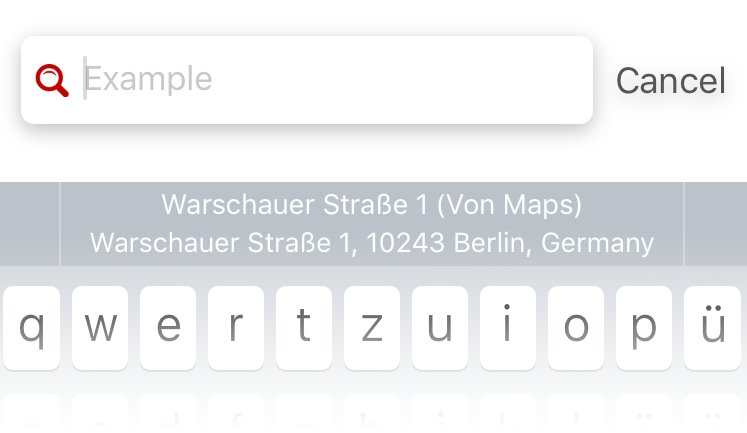
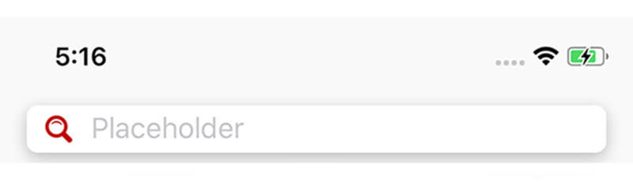

<!-- <p align="center">

</p> -->

<h1 align="center">SHSearchBar</h1>

<p align="center">
  <a href="https://github.com/Blackjacx/SHSearchBar"></a>
  <a href="http://cocoadocs.org/docsets/SHSearchBar"></a>
  
  
  
  <!-- <a href="https://github.com/Carthage/Carthage"></a> -->
  <a href="https://github.com/Blackjacx/SHSearchBar/blob/develop/LICENSE?raw=true"></a>
  <a href="https://codecov.io/gh/blackjacx/SHSearchBar"></a>
  <a href="https://codebeat.co/projects/github-com-blackjacx-shsearchbar"></a>
  <a href="http://cocoadocs.org/docsets/SHSearchBar/"></a>
  <a href="https://www.paypal.me/STHEROLD"></a>
</p>

The clean and shiny search bar that does what UISearchBar does only with dirty 
hacks. This view is designed to tackle the customization limits of UISearchBar. 
The difference here is that this class does not inherit UISearchBar but 
composes a new UIView object by using a UITextField that is much easier to use. 
These are the limits of the UISearchBar:

- no clean way to left align the placeholder
- the cancel button is hard to taylor to your needs
- generally the appearance is not customizable (e.g. the font of the text)
- there are some strange behaviours when you set a custom background image

Since I use a UITextField these restrictions do not apply.

## Installation

SHSearchBar is compatible with `iOS 9` or higher and builds with `Xcode 9` 
and `Swift 4` syntax. It is available through [CocoaPods](http://cocoapods.org). 
To install it, simply add the following line to your Podfile:

```ruby
pod "SHSearchBar"
```

## Examples

The repo includes an example project. It shows shows different use cases of 
the searchbar. To run it, just type `pod try SHSearchBar` in your console and 
it will be cloned and opened for you. The following images show some of these 
use cases:

<p align="center">
<caption align="center">You can show a custom placeholder like for normal text fields:</caption><br />

</p>

<p align="center">
<caption align="center">And you can even type text into that searchbar:</caption><br />

</p>

<p align="center">
<caption align="center">Wow there are customizable accessory views too:</caption><br />

</p>

<p align="center">
<caption align="center">Easily customize text and cancel button as you want:</caption><br />

</p>

<p align="center">
<caption align="center">You can customize each corner radius of the text field so that layouts like this become an ease:</caption><br />

</p>

<p align="center">
<caption align="center">The inner text field supports the new iOS 10 'textContentMode':<br />(Re-uses the address searched in Apple Maps before)</caption><br />

</p>

<p align="center">
<caption align="center">You can use the search bar inside a UINavigationBar:</caption><br />

</p>

## Contribution

- If you found a **bug**, open an **issue**
- If you have a **feature request**, open an **issue**
- If you want to **contribute**, submit a **pull request**

## Author

Stefan Herold, stefan.herold@gmail.com

## License

SHSearchBar is available under the MIT license. See the LICENSE file for more 
info.
