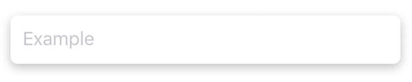
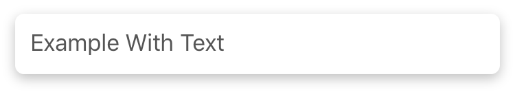
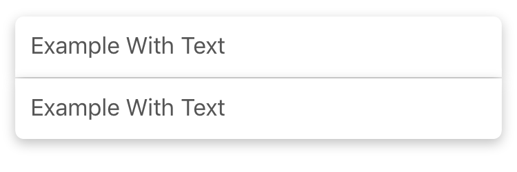
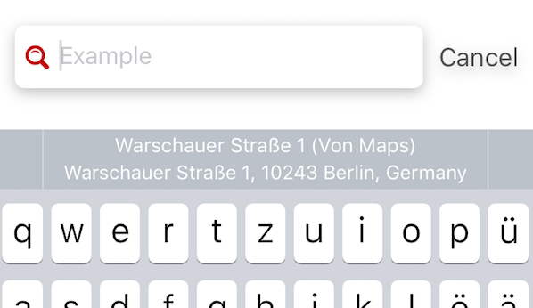

# SHSearchBar


<!-- <p align="center">
  
</p> -->

<p align="center">
  <a href="https://travis-ci.org/Blackjacx/SHSearchBar"></a>
  <a href="http://cocoadocs.org/docsets/SHSearchBar"></a>
  <a href="http://cocoadocs.org/docsets/SHSearchBar/"></a>
  <a href="http://cocoadocs.org/docsets/SHSearchBar/"></a>
  <a href="http://codecov.io/gh/blackjacx/SHSearchBar"></a>
  <a href="https://codebeat.co/projects/github-com-blackjacx-shsearchbar"></a>
</p>

The clean and shiny search bar that does what UISearchBar does only with dirty hacks. This search bar class is designed to overcome the customization limits of UISearchBar. The difference here is that this class does not inherit UISearchBar but composes a new UIView object by using a UITextField that is much easier to use. The limits of the search bar are as follows:

- no clean way to left align the placeholder
- the cancel button is hard to taylor to your needs
- generally the appearance is not customizable (e.g. the font of the text)
- there are some strange behaviours when you set a custom background image

Since I use a UITextField these restrictions do not apply.

## Installation

SHSearchBar is compatible with `iOS 8` or higher and build with `Xcode 8` and `Swift 2.3` syntax. It is available through [CocoaPods](http://cocoapods.org). To install it, simply add the following line to your Podfile:

```ruby
pod "SHSearchBar"
```

## Example

The repo includes an example project. It shows shows different use cases of the searchbar. To run it, clone the repo and run `pod install` from the Example directory first. The following images show some of these use cases:

<p align="center">
<caption align="center">You can show a custom placeholder like for normal text fields:</caption><br />

</p>

<p align="center">
<caption align="center">And you can even type text into that searchbar:</caption><br />

</p>

<p align="center">
<caption align="center">Wow there are customizable accessory views too:</caption><br />

</p>

<p align="center">
<caption align="center">Easily customize text and cancel button as you want:</caption><br />

</p>

<p align="center">
<caption align="center">You can customize each corner radius of the text field so that layouts like this become an ease:</caption><br />

</p>

<p align="center">
<caption align="center">The inner text field supports the new iOS 10 'textContentMode':<br />(Re-uses the address searched in Apple Maps before)</caption><br />

</p>

## Author

Stefan Herold, stefan.herold@gmail.com

## License

SHSearchBar is available under the MIT license. See the LICENSE file for more info.
