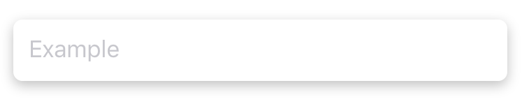
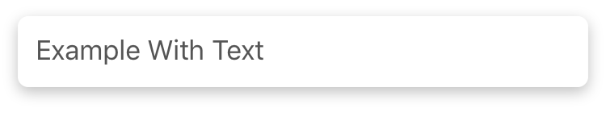
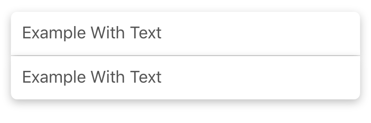
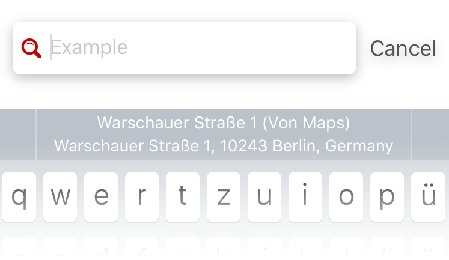
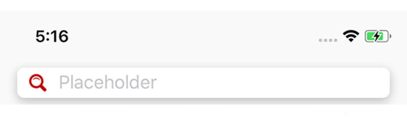

<!-- 

 -->

<h1 align="center">SHSearchBar</h1>

 

The clean and shiny search bar that does what UISearchBar does only with dirty 
hacks. This view is designed to tackle the customization limits of UISearchBar. 
The difference here is that this class does not inherit UISearchBar but 
composes a new UIView object by using a UITextField that is much easier to use. 
These are the limits of the UISearchBar:

- no clean way to left align the placeholder
- the cancel button is hard to tailor to your needs
- generally the appearance is not customizable (e.g. the font of the text)
- there are some strange behaviors when you set a custom background image

Since I use a UITextField these restrictions do not apply.

## Installation

### [Swift Package Manager](https://swift.org/package-manager/)

In Xcode open your target list and select your project. Click the tab `Swift 
Packages` and there the small `+` icon. Enter the URL of this repository, 
select the version you want to install - usually the preset is okay - and 
confirm.

### [CocoaPods](http://cocoapods.org)

Since SHSearchBar uses localized resources I dropped CocoaPods support in favor for SPM from version `2.0.0`. 
Please integrate the package via SPM (see above).

### Carthage

Since SHSearchBar uses localized resources I dropped Carthage support in favor for SPM version `2.0.0`. 
Please integrate the package via SPM (see above).

## Examples

The repo includes an example project. It shows shows different use cases of 
the searchbar. To run it, just type `pod try SHSearchBar` in your console and 
it will be cloned and opened for you. The following images show some of these 
use cases:

<caption align="center">You can show a custom placeholder like for normal text fields:</caption> 

<caption align="center">And you can even type text into that searchbar:</caption> 

<caption align="center">Wow there are customizable accessory views too:</caption> 

<caption align="center">Easily customize text and cancel button as you want:</caption> 

<caption align="center">You can customize each corner radius of the text field so that layouts like this become an ease:</caption> 

<caption align="center">The inner text field supports the new iOS 10 'textContentMode': (Re-uses the address searched in Apple Maps before)</caption> 

<caption align="center">You can use the search bar inside a UINavigationBar:</caption> 

## Contribution

- If you found a **bug**, please open an **issue**.
- If you have a **feature request**, please open an **issue**.
- If you want to **contribute**, please submit a **pull request**.

## Author

[Stefan Herold](mailto:stefan.herold@gmail.com) • 🐦 [@Blackjacxxx](https://twitter.com/Blackjacxxx)

## License

SHSearchBar is available under the MIT license. See the [LICENSE](LICENSE) file for more info.
